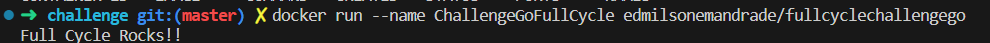
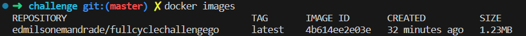

# DS Vendas

# About the project

Challenge to create a GO image with less than 2MB

## Features

- Print: Full Cycle Rocks!!

## Docker

 
   
    
docker run --name ChallengeGoFullCycle edmilsonemandrade/fullcyclechallengego

   
  After running the Docker image, terminal will print : => Full Cycle Rocks!!

## Images

# Technologies used

- GO Lang
- Docker

# How to run the project

## Prerequisites

<a href="https://go.dev/doc/install" target="_blank">Go Lang</a>

## Command

- go run main

# Author

<a href="https://www.linkedin.com/in/eemandrade/" target="_blank">Edmilson Emmanuel Moura Andrade</a>
